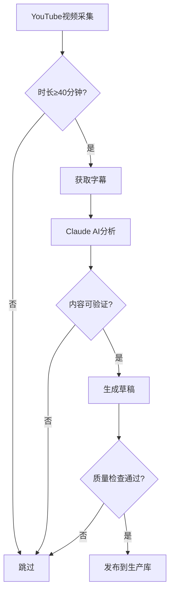

# 思想雷达内容质量控制规范 (v2.0)

> 🔴 **最高优先级**：100% 真实 · 100% 准确 · 100% 优质
> 
> 本规范为强制执行标准，任何违反行为都是不可接受的。

---

## 零、环境隔离原则（绝对规则）

```
⛔ 测试数据绝对不能出现在用户端
⛔ 测试环境和生产环境必须完全隔离
⛔ 任何虚构/示例/占位内容禁止进入生产数据库
```

| 环境 | 允许的数据类型 |
|------|---------------|
| 开发/测试 | 可使用测试数据，明确标记为"TEST" |
| 生产环境 | **只允许100%真实、可验证的内容** |

**违反此规则等同于系统故障，必须立即修复。**

---

## 一、核心原则（不可妥协）

### 1.1 真实性原则

| 要求 | 级别 | 说明 |
|------|------|------|
| **禁止虚构** | 🔴 零容忍 | 不得创造任何不存在的文章、演讲、论文 |
| **禁止捏造** | 🔴 零容忍 | 不得编造作者未说过的话或未表达的观点 |
| **禁止错误** | 🔴 零容忍 | 事实陈述必须100%准确（日期、事件、数据） |

### 1.2 可验证原则

**每条内容必须满足：**

1. ✅ 真实存在的原始来源（URL可访问或视频可查证）
2. ✅ 准确的发布日期（不能编造或估计）
3. ✅ 真实的作者身份（可独立验证）
4. ✅ 忠实的观点提取（不歪曲原意）

### 1.3 事实检查

在发布任何内容前，必须核实：

- [ ] 来源文章/视频真实存在
- [ ] 发布日期准确无误
- [ ] 作者身份正确
- [ ] 引用内容忠实于原文
- [ ] 事件时间线正确（如：乌克兰战争始于2022年2月）

---

## 二、生产数据完整性原则

### 2.1 数据不可变性

```
⚠️ 生产数据库中的内容一旦发布：
- 系统不得随意修改
- 系统不得随意删除
- 只有发现重大质量问题时才能介入
```

### 2.2 用户数据神圣性

```
⚠️ 用户的选择（收藏、立场）：
- 正式记录在数据库中
- 系统永远不得擅自修改
- 只有用户本人可以更改
- 迁移或重置需用户明确授权
```

### 2.3 例外情况

仅在以下情况可修改生产数据：

1. **发现虚构内容**：立即删除并通知
2. **发现严重事实错误**：修正并记录
3. **法律合规要求**：按法规执行
4. **用户主动请求**：删除其数据

---

## 三、内容生成流程

### 3.1 自动化流程



### 3.2 质量检查点

| 检查项 | 验证方法 |
|--------|----------|
| 视频存在 | YouTube API确认 |
| 字幕可用 | 字幕文本长度≥1000字符 |
| 来源格式 | 包含日期、平台、具体标题 |
| 内容长度 | ≥500字符 |
| 无事实错误 | AI验证时间线等 |

### 3.3 手动添加要求

手动添加内容时需提供：

1. **原始链接**：可访问的URL
2. **截图证据**：关键引用的截图
3. **添加理由**：为何值得收录
4. **责任人签名**：谁添加谁负责

---

## 四、错误处理

### 4.1 发现错误时

1. **立即下架**：从生产库删除
2. **清理关联**：删除相关用户操作
3. **记录日志**：写入错误档案
4. **通知用户**：如影响到用户数据
5. **根因分析**：防止再次发生

### 4.2 错误日志格式

```
日期: 2026-01-22
错误ID: ERR-2026-0122-001
内容ID: 24
错误类型: 事实错误
错误描述: "乌克兰战争两周年"实际应为四年
处理措施: 删除内容
责任归属: 示例数据虚构
```

---

## 五、责任声明

- **内容创建者**：对内容真实性负责
- **系统管理员**：对数据完整性负责
- **自动化流程**：只处理可验证的来源

---

*版本: v2.0*
*生效日期: 2026-01-22*
*本规范为最高标准，任何例外需书面批准*
